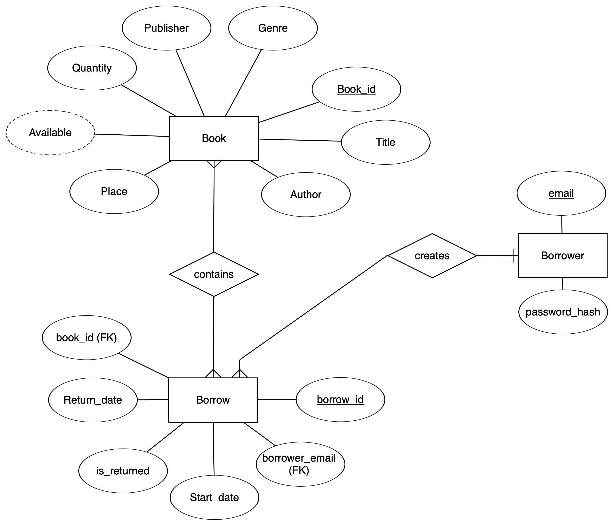

# library_management_task

Basic Library Management System

### Steps

1. Open cmd/terminal and clone the repository (ensure git is installed or use GutHub Desktop)

```bash
git clone https://github.com/clumsyspeedboat/library_management_task.git
```

2. "cd" into the repository

```bash
cd <path_to_your_dir>/library_management_task
```

3. Create virtual environment (ensure python is installed and added to PATH)

```bash
python -m venv env
```

4. Activate virtual environment

```bash
env\Scripts\activate # on Windows
source env/bin/activate # on Linux/Mac
```

5. Install dependencies/packages

```bash
pip install -r requirements.txt
```

5. Run Flask app

```bash
python app.py
```

6. Navigate to localhost (port will be displayed in terminal)

```bash
http://localhost:5000 # Most probably
```

## ER Diagram



### **New Entries and Attributes**

1. The `Book` entity has two new attributes: `Quantity`, which tracks the number of copies the library has, and `Place`, which indicates the book's physical location in the library.
2. The `Borrower` entity is newly introduced, containing `email` as the primary key and `password_hash` for secure login.
3. The `Borrow` entity is also new and includes the following attributes: `borrow_id` as the primary key, `book_id` as a foreign key linking to the `Book` entity, `borrower_email` as a foreign key linking to the `Borrower` entity, `Start_date` for the date the book was borrowed, `Return_date` for the expected return date, and `is_returned`, a boolean flag indicating whether the book has been returned.

### **Step-by-Step Physical Scenario**

When a user wants to check the availability of a book, the system computes the book's `available` status by calculating the difference between the `Quantity` attribute and the number of non-returned `Borrow` entries linked to that book. If this computed value is greater than zero, the book is marked as available.

For borrowing a book, the user first logs in using their `email` and `password_hash` stored in the `Borrower` entity. Once authenticated, the system verifies if the user has fewer than three active borrows (where `is_returned = false`) and no overdue borrows (where `Return_date` is in the past and `is_returned = false`). If these conditions are satisfied, a new `Borrow` entry is created, recording the `borrow_id`, `book_id`, `borrower_email`, `Start_date`, and `Return_date`.

When the user returns the book, they must scan it. The system updates the corresponding `Borrow` entry by setting `is_returned` to `true`. Finally, the system monitors overdue borrows by checking the `Borrow` entity for entries where `is_returned = false` and `Return_date` has passed, ensuring timely notifications are sent to the respective borrowers.

## Design and Implementation Decisions

### Architecture

The application uses Docker Compose to orchestrate three services:

- Flask application container
- PostgreSQL database container
- PgAdmin container for database management (optional, activated with admin profile)

The backend consists of two layers:

1. Data access layer in `db.py`
2. Business logic layer in `app.py`

### Security Features

- Password hashing for borrower authentication
- Admin-specific endpoints with separate authentication

### Database Design

- Indexes on frequently queried fields for performance

### Frontend Architecture

- Static files organized in separate directories (css, js, data)
- Responsive templates for both user and admin interfaces
- Client-side validation complementing server-side checks

### Notable Features

- Book availability tracking
- Automated overdue book monitoring
- Support for multiple copies of the same book
- Three-book limit per borrower enforcement
- Physical location tracking for books
